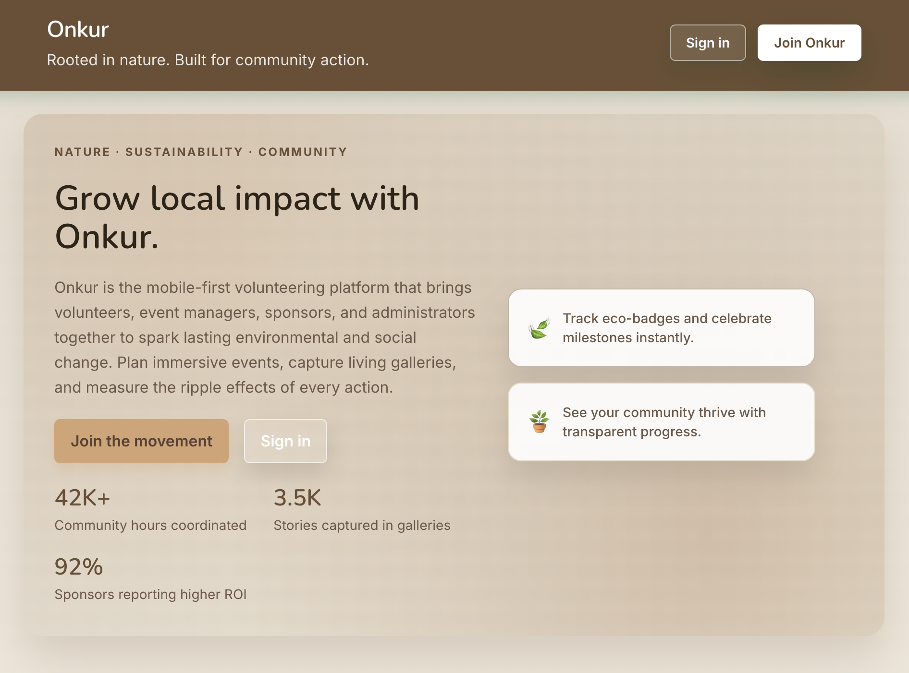
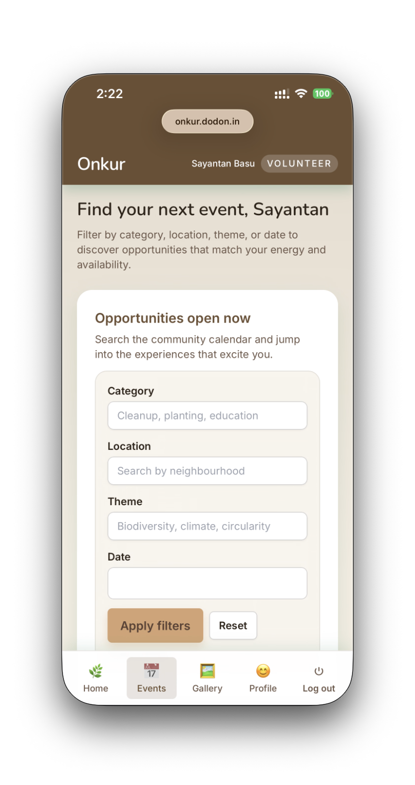
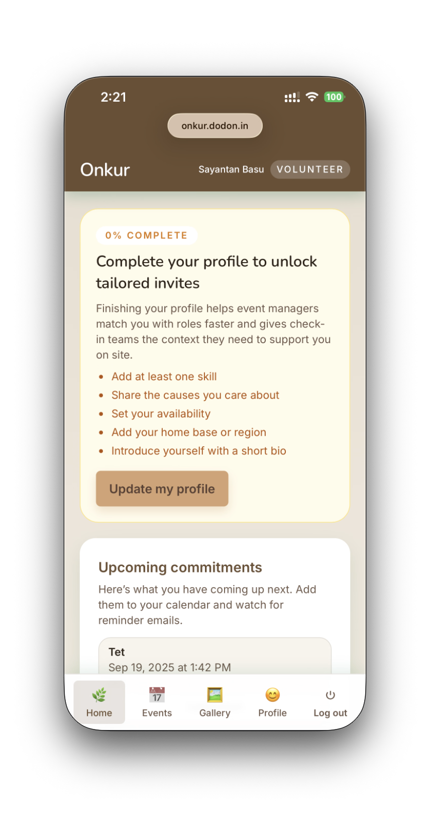

# Onkur

Onkur is a sustainability-driven volunteering platform that helps communities coordinate events, celebrate impact stories, and nurture sponsor partnerships. The repository contains an Express + PostgreSQL API (`backend/`) and a Vite + React client (`frontend/`). This refresh aligns the project with shared conventions, automated quality checks, and documentation so teams can steward the forest together.

## Demo

A live demo is available here: [Demo App](https://onkur.dodon.in)

**Important notes**
- The demo server may be offline at times (it is rebuilt daily).
- **All data is reset once per day** — do not use it for important storage.
- The demo is provided for evaluation and testing purposes only.

## Landing Page



## Mobile Layout Screenshots

<p align="center">
  
  
</p>


## Table of contents

- [Architecture](#architecture)
- [Getting started](#getting-started)
- [Running the backend](#running-the-backend)
- [Running the frontend](#running-the-frontend)
- [Quality gates](#quality-gates)
- [Testing](#testing)
- [Environment & configuration](#environment--configuration)
- [Project documentation](#project-documentation)
- [Contributing](#contributing)
- [License](#license)

## Architecture

```
.
├── backend/            # Express API, PostgreSQL data access, object storage helpers
│   ├── src/            # Application source (features auto-registered via /routes)
│   ├── tests/          # Jest unit tests for services and repositories
│   └── scripts/        # Operational utilities (SMTP smoke test, etc.)
├── frontend/           # Vite + React dashboard with Tailwind design tokens
│   ├── src/features/   # Role-aware experiences and lazy-loaded routes
│   ├── src/lib/        # API clients, context providers, shared hooks
│   └── src/styles/     # Theme primitives and responsive layout helpers
├── docs/               # Living wiki entries and product imagery
├── .github/workflows/  # Continuous integration pipelines
├── docker-compose.yml  # Optional orchestration for API + web app
└── README.md
```

Key product personas:

- **Volunteers** track commitments, log hours, and browse mobile-first event discovery flows.
- **Event managers** coordinate tasks, attendance, and post-event reporting from a dedicated workspace.
- **Sponsors** steward partnerships, manage profiles, and review the impact of their contributions.
- **Administrators** oversee moderation, role assignments, audit trails, and health dashboards.

Highlights span multi-role onboarding, gallery storytelling with MinIO/S3 storage, transactional email templates, impact analytics, and CSV-ready reporting across roles.

## Getting started

Clone the repository and install dependencies for both workspaces.

```bash
git clone <repository-url>
cd Onkur

# Backend setup
cd backend
npm install

# Frontend setup (in a separate shell)
cd frontend
npm install
```

Node.js 20+ matches the Docker images and CI workflow.

## Running the backend

```bash
cd backend
cp .env.example .env   # supply Postgres, SMTP, and MinIO credentials
npm run dev            # start the API with Nodemon
```

The server boots from `src/server.js`, seeds admin and volunteer lookup data, and mounts feature routers discovered under `src/features/**/` via the auto-loader in `src/routes/index.js`. Service modules rely on the shared configuration layer (`src/config`) and Winston logger (`src/utils/logger.js`).

### SMTP smoke test

```bash
npm run send:test-email
```

Use the SMTP smoke test when validating template branding or credential updates. Database and object storage connectivity checks are available through `npm run test:connections`.

## Running the frontend

```bash
cd frontend
cp .env.example .env    # configure API origin and support contact
npm run dev             # launch the Vite development server
```

The client leans on Tailwind primitives defined in `src/styles/theme.css`, route-level Suspense boundaries inside `src/features/layout`, and role-aware dashboards organized by feature directories. Visit `http://localhost:5173` to explore the mobile-first shell.

## Quality gates

Automated checks live in `.github/workflows/ci.yml` and execute on every push or pull request:

- `npm run format:check` – Prettier formatting guard for backend or frontend sources/tests.
- `npm run lint` – ESLint (with Prettier integration) for each workspace.
- `npm run test` – Jest on the backend and Vitest on the frontend.
- `npm run build` – Production build for the React client.

Run them locally before you push:

```bash
# backend
cd backend
npm run format:check
npm run lint
npm test

# frontend
cd ../frontend
npm run format:check
npm run lint
npm run test
npm run build
```

## Testing

Backend unit tests live under `backend/tests/`, covering authentication, volunteer journey helpers, and impact analytics repositories. Add new Jest cases alongside the modules you touch. Frontend Vitest specs reside in `frontend/src` (see `App.test.jsx` and feature-specific suites) and rely on React Testing Library. Coverage artifacts stay inside their respective workspace directories (ignored by Git).

Integration tests can extend the backend suite with Supertest; wire them into the `backend/tests/` tree and update CI if additional services are required.

## Environment & configuration

- `backend/.env.example` lists required server variables, including PostgreSQL, JWT, SMTP, MinIO, and bootstrap admin credentials.
- `frontend/.env.example` exposes the API base URL and verification support contact shown after signup.
- Docker users can run `docker compose up --build` to orchestrate both services; provision PostgreSQL and MinIO separately or connect to existing instances via the environment variables.

## Project documentation

- `docs/Wiki.md` – running history of architectural decisions, rollout milestones, and operational guides.
- Product imagery under `docs/` – desktop and mobile screenshots for decks or onboarding materials.
- Workspace-specific `AGENTS.md` files capture conventions for backend features, frontend routing, and styling; update them whenever you introduce new patterns.

## Contributing

Review [CONTRIBUTING.md](CONTRIBUTING.md) for the end-to-end workflow, coding standards, and review expectations. Community norms live in the [CODE_OF_CONDUCT.md](CODE_OF_CONDUCT.md). Highlights:

- Keep backend feature work under `src/features/<feature-name>/` and export routers from files ending in `.route.js`.
- Add or update Jest and Vitest coverage alongside any behavior changes.
- Sync documentation updates with the wiki and README when configuration or workflows evolve.
- Run the quality gates (format, lint, test, build) before requesting review.

## License

This project is licensed under the [MIT License](LICENSE).
